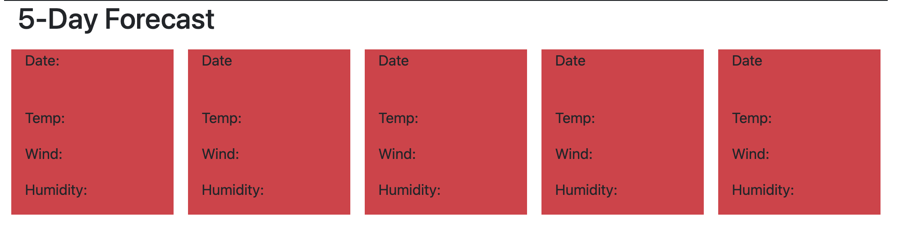

# CloudyWithAChanceOfCode

Welcome to CloudyWithAChanceOfCode! This GitHub repository is your travel companion for weather forecasting in multiple cities. As a traveler, you can now easily access the weather outlook for various destinations and plan your trips accordingly. Whether you're preparing for a business trip or a vacation, CloudyWithAChanceOfCode provides you with the essential weather information you need.

Explore the weather forecasts for the next 5 days while staying up-to-date with software development and technology trends. This project offers a seamless integration of travel planning and coding exploration, ensuring that you're well-prepared for your journeys.

## Screenshots

*Screenshot 3: User-friendly interface for easy navigation.*

*Screenshot 2: Detailed weather information for the current date.*

*Screenshot 1: Weather outlook for multiple cities.*

## Deployment

Access the deployed version of CloudyWithAChanceOfCode through this URL: [https://jesk3r.github.io/CloudyWithAChanceOfCode/](https://jesk3r.github.io/CloudyWithAChanceOfCode/)